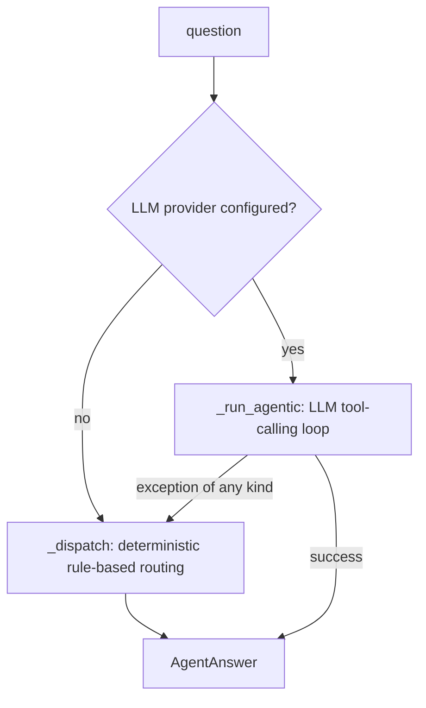

# Chat / Reasoning Agent (Stage 3 "ask" + Stage 4 "reason")

Plain-language explainer of the chat agent stack — how a natural-language question turns into a
grounded, evidence-cited answer in the UI. Counterpart to [ENTITY_RESOLUTION.md](ENTITY_RESOLUTION.md)
(Stage 1) and [ONTOLOGY.md](ONTOLOGY.md) (Stage 2/3 graph) — this doc covers everything downstream of
the graph: the reasoning agent, the LLM providers, the HTTP API, and the frontend that renders it.

> **Maintenance rule (same discipline as the other two docs):** any change to `ontology_builder/agent.py`,
> the chat/tool-calling parts of `ontology_builder/llm_provider.py`, `server.py`'s `/api/chat` handling, or
> `frontend/app.js`'s answer-rendering logic must be reflected here in the same turn as the code edit — new
> quirks/bugs found go in "Quirks & gotchas", new fields/behavior go in the relevant section above it, not
> as an afterthought.

---

## 1. Two answer modes, chosen automatically

`ontology_builder/agent.py`'s `answer_question(question, entities, kg)` is the single entry point. It picks
one of two modes, entirely transparently to the caller (`server.py`):



- **No LLM configured** (`get_text_generation_provider()` returns `NullTextGenerationProvider`) → always
  uses `_dispatch`, the deterministic path.
- **LLM configured** → tries `_run_agentic` first. **Any** exception (network error, malformed response,
  tool-calling unsupported by the model, timeout, etc.) is caught in `answer_question` and silently falls
  back to `_dispatch` — the chat must never hard-fail from an LLM hiccup.

This means the demo/system always answers something, and the UI never shows a raw stack trace.

**Streaming counterpart:** `stream_answer(question, entities, kg)` is the live-events version `/api/chat`
actually calls (see §3) -- same fallback discipline (agentic first, deterministic on any failure), but
yields `_run_agentic_events()`'s plan/tool_call/tool_result events as they happen instead of only returning
once at the end. `answer_question()` above still exists as the non-streaming form (drains the same generator
and returns just the final answer) for any caller that doesn't need live events.

### 1a. Deterministic fallback (`_dispatch`)

Rule-based, **not** an LLM — built to answer the exact scenarios in `docs/TEAM_HANDBOOK.md` Sec 7, but also
serves as the "no AI configured" safety net for arbitrary questions about the 8 known aliased assets.

1. **Resolve the asset(s).** `_match_aliases(question)` does keyword matching against `_ALIASES`, a small
   hardcoded list of `{name, anchor, keywords}` dicts. `anchor` is a `(system, local_id)` pair from Stage 1
   (e.g. `("AM", "PMP-100-101")`), **not** a hardcoded `unified_id` — because cluster numbering
   (`ASSET-001`, `ASSET-002`, ...) can shift between pipeline runs, but a system's own local ID for a piece
   of equipment never does. `_anchor_to_unified_id()` resolves the anchor to whatever `unified_id` that
   asset currently has in the just-loaded `entities` list.
2. **Route by keyword** in `_dispatch`: checks for `"same problem"`/`"same as"`, `"everything"`/`"show me"`,
   `"maintenance"` + `"last week"`/`"operations"`, `"vibrat"`, `"fuel"`, `"differential pressure"`/`"flooding"`/
   `" dp"`, `"alarm"` — first match wins, in that order. Falls through to `_answer_full_context` if nothing
   matches (i.e. any recognized asset with an unrecognized question still gets *something* useful back).
3. **Gather evidence** per handler via `KnowledgeGraph.context_for_asset(unified_id)` (all directly-connected
   alarms/work orders/operator actions/health events/cost postings) plus targeted `historian_series()`/
   `_trend()` calls for specific tags — **never** the whole ~518k-row historian file.
4. **Apply a small ranking/causal heuristic** (hand-written per scenario, see `_answer_vibration`,
   `_answer_fuel_rising`, `_answer_high_dp`, `_answer_same_problem`, `_answer_alarm_flood`,
   `_answer_full_context`, `_answer_maintenance_ops_join`) and return an `AgentAnswer` — natural-language
   `answer`, a Markdown `recommendation`, a short `headline`, a `confidence` tier string
   (`"high"`/`"medium-high"`/`"medium"`/`"low"`/`"n/a"`), and a structured `evidence` list so the UI can cite
   sources.

Key per-handler details worth knowing:

> **Evidence-gated since 2026-07-29:** the handlers originally asserted each planted scenario's scripted
> conclusion whenever their route matched — which produced confidently *wrong* answers on question
> variants ("Why are there so many alarms on P-101?" got S5's "nuisance alarm" verdict for 3 genuine
> vibration alarms; "Is P-102 the same problem as P-101?" replayed S4's lube-oil/CV-400 narrative for a
> pairing it doesn't apply to). Every conclusion below is now derived from records actually found in the
> graph, and `tests/test_agent_dispatch.py` locks in both the canonical questions and those variants.

- **`_causal_factors(entities, kg, unified_id)`** — the shared evidence collector behind the vibration and
  comparison handlers. Emits a factor **only when its supporting records exist**: a recent (<7d) operator
  setpoint *increase* on the asset's own loop; recent (<14d) seal work on the asset itself; a non-Closed
  work order on a `COOLS`/`SUPPLIES_UTILITY` upstream asset (corroborated by the asset's own rising
  lube-oil trend when it has a `LUBE_01` tag); or a falling own-suction-pressure trend (cavitation
  signature). Each factor carries its own sentence, evidence records, and recommendation line.
- `_answer_vibration`: reports the vibration trend, then composes causes from `_causal_factors`. The
  headline is picked from the factor *kinds* found: setpoint+seal → the S1 joint conclusion;
  `utility_cooling_problem` → "lube-oil overheating from upstream cooling problem" (this is how "why is
  the compressor vibrating?" reaches K-101's real cause); single factors get their own headlines; no
  factors → "no clear cause found" at low confidence.
- `_answer_fuel_rising`: walks one `FEEDS` hop upstream (e.g. heater ← exchanger) to check for exchanger
  fouling (falling outlet-temp trend + an open/closed cleaning work order).
- `_answer_high_dp`: needs a genuine **two-hop** traversal (Column ← H-101 ← E-101) to surface both
  contributing causes (upstream fouling cascading through the heater, *and* reflux-pump cavitation via
  falling suction pressure). The headline/recommendations only name the causes actually found — if the
  graph's topology is missing the reflux edge (see the cache warning below), it says "cold feed from
  upstream fouling" instead of claiming the full scripted chain.
- `_answer_same_problem`: fully generic comparison — runs `_causal_factors` for **both** assets
  independently and compares the factor-kind sets. Disjoint sets → "No — different root causes" (S4's
  expected answer, but equally correct for P-102-vs-P-101: seal+setpoint vs cavitation); overlapping →
  "Partly — they share …"; either side without evidence → "Inconclusive" at low confidence. No scripted
  verdict anywhere.
- `_answer_alarm_flood`: **gated** on an actual flood signature (`_ALARM_FLOOD_MIN_TRANSITIONS = 15`; the
  planted TK-201 flood has 120 transitions, every genuine alarm in the data has ~3). Below the gate it
  reports the alarms as genuine — quantifying how far past the configured H limit the values actually went
  — and, for vibration alarms, hands off to `_answer_vibration` so the user gets the real root cause. Only
  above the gate does it make the nuisance/mis-set-limit case, citing the configured limit + deadband.
- `_trend(tag, window_hours=...)` **window choice matters**: 48h default works for fast-moving signals
  (vibration), but slow trends (fouling outlet-temp, lube-oil temp) need `24*14` (14 days) or they falsely
  look "stable". This was a real bug found earlier in the project (see repo memory).
- `NOW = 2026-07-28T06:00:00+00:00` is a fixed constant (not `datetime.now()`) — the scenario has a fictional
  "current" date baked into the sample data, and all "N hours/days ago" phrasing must be computed against
  it, not wall-clock time.

### 1b. Agentic mode (`_run_agentic` / `_run_agentic_events`)

The LLM is given **read-only tools** to query the knowledge graph itself, rather than being handed a
pre-baked answer to polish. This is the "expose the graph via tools, build an agent that reasons" pattern
(handbook Stage 4).

**Tools exposed** (`TOOL_SCHEMAS`, OpenAI tool-calling JSON schema shape):

| Tool | Purpose | Notes |
|---|---|---|
| `write_plan` | Write/update a step-by-step investigation plan (list of `{text, status}`), shown live to the user as a checklist | UI-only — doesn't query the graph. The system prompt instructs the model to call this FIRST, then again whenever a step's status changes. Handled inline in the loop (not via `_TOOL_EXECUTORS`) since it just updates `plan_steps`, not the KG |
| `list_assets` | Every physical asset, canonical name, per-system IDs | Model calls this first if it doesn't know the exact `unified_id` |
| `get_asset_context` | All alarms/alarm-point configuration/work orders/operator actions/health events/cost postings/historian tags connected to one asset | Wraps `KnowledgeGraph.context_for_asset`; adds a human `time_ago` string per record. Includes `AlarmConfig` records (configured HH/H/L/LL limits + deadband, see §6) alongside `AlarmEvent` |
| `get_historian_trend` | Direction + %change of one tag over a window (never raw rows) | Wraps `_trend()`; caller picks `window_hours` (short for vibration, long for fouling) |
| `get_related_assets` | `FEEDS`/`COOLS`/`SUPPLIES_UTILITY` process-flow relationships | Enables multi-hop causal reasoning across equipment |
| `search_evidence` | Free-text substring search over alarm/work-order/operator-action/health-event/cost-posting fields (notes, symptoms, alarm points, technicians, etc.), optionally scoped by `systems` | Added to unblock open-ended, content-first questions not anchored to a known asset (e.g. "which work orders mention a shim kit"). Each match includes its resolved `asset_id`/`asset_name` via `_asset_for_record()`. Capped at `max_results` (default 20, max 50) |
| `get_plant_status_summary` | Plant-wide snapshot: every ACTIVE alarm, every non-`Closed` work order, recent APM health events, across ALL assets | Added for "what's going on right now" questions that aren't about one specific asset. Capped (30/30/15) — a snapshot, not an exhaustive dump |

`search_evidence`/`get_plant_status_summary` results feed into `_primary_asset_id_from_trace()` (as a lower-
priority fallback after `get_asset_context`/`get_related_assets`) and `_flatten_evidence()` (so their matches
show up as ordinary evidence cards/timeline entries) — see §3.

**Loop** (`_run_agentic_events`, a generator; `_run_agentic` just drains it for the non-streaming form; max
`_MAX_AGENT_TURNS = 12` turns — raised 6 → 7 when `write_plan` was added (a mandatory first plan call uses
part of the budget), then 7 → 12 after live-testing found a genuine 2-hop question (Column dP ← H-101 ←
E-101 fouling, the S3 cascade) hit "inconclusive within the tool-call budget" despite the model having
already gathered all the correct evidence — `write_plan` update calls each consume a full turn just like a
real tool call, and a multi-hop question needs genuinely sequential calls (can't look up H-101's own
upstream neighbor E-101 until `get_related_assets(H-101)` has already returned), which can't be batched into
fewer turns the way independent lookups can):
1. Seed `messages` with `_AGENT_SYSTEM_PROMPT` (rules: call `write_plan` first and keep it updated, always
   use tools before answering, never invent facts/IDs/numbers, cite specific evidence, consider
   upstream/downstream assets, use short/long historian windows appropriately, say so explicitly if evidence
   is inconclusive) + the user's question.
2. Call `provider.chat(messages, tools=TOOL_SCHEMAS, max_tokens=1600)`.
3. For each `tool_call` in the response: if it's `write_plan`, normalize+store the steps
   (`_normalize_plan_steps`) and `yield {"type": "plan", "steps": [...]}` — no KG query, no walk step.
   Otherwise, `yield {"type": "tool_call", "tool", "arguments", "label"}` (a human-readable "doing X" label
   via `_tool_call_label()`) **before** executing, so a live UI can show "in progress" the moment the model
   decides to look something up; then execute via `_TOOL_EXECUTORS`, append the result to `trace` +
   `messages` (via `_trend_result_for_llm()`, which **strips the `points` array** — the chart-only
   per-minute downsampled series — before sending the trend result back to the model; the model only needs
   summary stats, and the raw points would waste a large slice of the token budget for no reasoning benefit),
   and `yield {"type": "tool_result", "tool", "walk_step"}` (`walk_step` from `_walk_step_for_tool_call()` —
   see §3's graph-walk section — or `None` if this call touched no resolvable node).
4. If a turn's response has no `tool_calls`, it's the final answer: parsed by `_split_agent_response()` into
   `(headline, root_cause, recommendation)`, yielded as one final `{"type": "final", "answer": AgentAnswer,
   "plan": [...]}` event.
5. If the loop exhausts all turns without a final answer, yields a low-confidence "inconclusive within the
   tool-call budget" final event (still includes the full `trace` as evidence).

**Required 3-section Markdown output format** (enforced only by prompt instruction, not by a schema/grammar):
```
## Headline
<= 12 words, no trailing period — shown as the big bold UI title

## Root Cause
3-5 sentences, cites specific evidence (work order IDs, action IDs, tag names)

## Recommended Actions
2-4 short bullet points
```
`_split_agent_response()` (regex on `^#{1,3}\s*<Heading>\s*$`, `re.MULTILINE`) parses this. **It never
raises** — any section it can't find just becomes `None` (recommendation) or falls back to "put everything
in root_cause" (if even `## Root Cause` is missing). This graceful degradation matters because prompt-only
formatting is not guaranteed; a model that ignores the format still produces a usable (if less structured)
answer instead of breaking the response.

`confidence` for agentic answers is always the literal string `"model-reasoned"` — a distinct tier from the
deterministic path's `"high"/"medium-high"/"medium"/"low"`, since there's no rule-based confidence score to
report. The frontend gives it its own purple badge (see §4).

`presented_by` is set to the model's name (e.g. `"databricks-claude-opus-4-8"`) for both modes when an LLM
is involved; `"rule-based"` when it isn't. The UI badge (`🤖 reasoned by <model>` vs `rule-based`) is the
only visible signal of which path actually answered a given question.

---

## 2. LLM providers (`ontology_builder/llm_provider.py`)

Two independent provider interfaces, each with the same "configured-but-broken should never crash the
pipeline" fallback philosophy:

- **`SimilarityProvider`** (`OfflineSimilarityProvider` difflib default, `EmbeddingSimilarityProvider` real
  embeddings) — used by **Stage 1 entity resolution**, not directly part of chat, but shares this module.
  See [ENTITY_RESOLUTION.md](ENTITY_RESOLUTION.md) for its details.
- **`TextGenerationProvider`** — used by chat/reasoning (this doc). Three implementations:
  - `NullTextGenerationProvider` — no model; `generate()`/`chat()` both raise `NotImplementedError`. This is
    what makes `answer_question` pick `_dispatch`.
  - `OpenAICompatibleTextGenerationProvider` — any OpenAI-compatible `/chat/completions` endpoint: OpenAI,
    Azure OpenAI, or (the one actually configured in this project) **Databricks Model Serving**
    (`https://<workspace-host>/serving-endpoints/chat/completions`). Implements both `generate()` (simple
    system+user prompt → text) and `chat()` (full messages + optional `tools`, returns the raw assistant
    message dict so the agentic loop can append it directly). Uses stdlib `urllib` only, no SDK dependency.
  - `MLXTextGenerationProvider` — local Apple Silicon model via `mlx-lm`. **Strictly opt-in** via
    `LOCAL_LLM_PROVIDER=mlx` env var — never attempted automatically, because a Metal initialization failure
    is a native `SIGABRT` that Python's `try/except` cannot catch and would take down the whole server
    process (see §5 "Quirks & gotchas").
- **Factory** `get_text_generation_provider()` — module-level cached singleton. Preference order:
  Databricks/OpenAI/Azure (if credentials present) → local mlx (only if explicitly opted in) → Null. Catches
  `RuntimeError` from a misconfigured OpenAI-compatible provider and `ImportError` from a missing mlx-lm
  install, falling through each time rather than raising.

### Environment variables that control the chat LLM

Read from real environment variables or a local, gitignored `.env` (auto-loaded by both `server.py` and
`ontology_builder/config.py` — see the "MAJOR METHODOLOGY BUG" entry in repo memory for why **both** load it):

| Variable | Purpose |
|---|---|
| `DATABRICKS_HOST` / `DATABRICKS_SERVER_HOSTNAME` | Workspace host (bare hostname or full URL, both accepted) |
| `DATABRICKS_TOKEN` | PAT — **never** print/log this; only report `len(value)` or presence/absence when debugging |
| `LLM_MODEL` / `DATABRICKS_MODEL` | Chat/tool-calling serving-endpoint name, e.g. `databricks-claude-opus-4-8` |
| `OPENAI_API_KEY` / `OPENAI_BASE_URL` / `OPENAI_MODEL` | Generic OpenAI-compatible alternative |
| `AZURE_OPENAI_API_KEY` / `AZURE_OPENAI_ENDPOINT` | Azure OpenAI alternative |
| `LOCAL_LLM_PROVIDER=mlx` | Opt-in to local mlx-lm (Apple Silicon only) |
| `LOCAL_LLM_MODEL` | mlx model repo id, default `mlx-community/Qwen2.5-3B-Instruct-4bit` |

Verified end-to-end and currently live: `DATABRICKS_HOST` + `LLM_MODEL=databricks-claude-opus-4-8` +
`DATABRICKS_TOKEN` in the real `.env`. Databricks-hosted Anthropic models reject `temperature`/
`response_format` on this endpoint shape, so `chat()` only sets `temperature` for non-`databricks-`-prefixed
model names.

---

## 3. HTTP layer (`server.py`)

Stdlib-only (`http.server.HTTPServer`, single-threaded, no Flask/FastAPI) — binds `127.0.0.1:8000` only
(never `0.0.0.0`). Loads `unified_entities.json` + the graph once at startup via
`ontology_builder.pipeline.load_or_build()` (cache-first, see [ONTOLOGY.md](ONTOLOGY.md) §caching), and
warms up the LLM provider **on the main thread before serving requests** (mlx-lm's Metal init isn't safe to
trigger lazily from a request-handling thread).

**Routes:**
| Route | Method | Purpose |
|---|---|---|
| `/`, `/index.html` | GET | Chat UI HTML |
| `/app.js`, `/style.css`, `/logo.svg` | GET | Static frontend assets |
| `/api/suggestions` | GET | Returns the 7 demo questions from `docs/TEAM_HANDBOOK.md` Sec 7 (`SUGGESTED_QUESTIONS` constant) |
| `/api/graph` | GET | Whole plant ontology (`KnowledgeGraph.to_node_link_json()`) for the persistent explorer panel (§4b) |
| `/api/chat` | POST | `{"question": "...", "history": [{"question", "answer"}, ...]?}` → `text/event-stream` of live plan/tool_call/tool_result events, ending with one `final` event carrying the full answer + evidence + UI panel JSON (same shape `/api/chat` always returned, before this was streamed) |

**`/api/chat` request handling (input validation, OWASP-relevant):**
- `Content-Length` must be present, `> 0`, and `<= MAX_BODY_BYTES` (32768; raised from 4096 when the
  optional `history` array was added) — rejects oversized/missing bodies with 400 before reading the body.
- Body must parse as JSON (`json.JSONDecodeError`/`UnicodeDecodeError` → 400).
- `question` must be a non-empty string; trimmed and truncated to `MAX_QUESTION_LEN` (500 chars).
- `history` (optional, for agentic follow-ups): must be a list or it's discarded; hard-capped at 8 entries
  server-side, then `agent._history_messages()` keeps only the last 4 valid `{question, answer}` string
  pairs, truncating each side to 2000 chars — hostile/malformed history degrades to no history, never an
  error. **The deterministic fallback ignores history entirely** (stateless per question), so follow-ups
  that rely on pronouns only resolve in agentic mode; the system prompt (rule 6b) tells the model to treat
  prior answers as context for reference resolution, never as evidence — facts must be re-verified via
  tools before being cited.
- No SQL/shell/file-path use of the question anywhere in the call chain — it only ever feeds into Python
  string `.lower()`/`in` keyword checks (`_dispatch`) or gets sent as an LLM prompt message (`_run_agentic`),
  so there's no injection surface in the traditional sense; the main risk is prompt injection via question
  content (see §5).
- Responses set `X-Content-Type-Options: nosniff`. No secrets are ever included in a response — `evidence`/
  `panel`/`answer` are all derived from local CSV-sourced data or LLM output, never environment variables.

**Response shape** (the `final` SSE event's `data:` payload — see "Streaming (SSE)" below for the events
that precede it):
```json
{
  "type": "final",
  "asset": "P-101" ,
  "scenario": "vibration" ,
  "answer": "...",
  "headline": "...",
  "recommendation": "- ...",
  "raw_answer": null,
  "presented_by": "databricks-claude-opus-4-8",
  "confidence": "model-reasoned",
  "evidence": [ ... ],
  "panel": { "entity": ..., "entity_id": "ASSET-002", "relationships": [...], "timeline": [...], "evidence": [...], "charts": [...], "walk": [...] },
  "plan": [ {"text": "...", "status": "done"}, ... ]
}
```

### Streaming (SSE) — `stream_answer()` → `/api/chat`

`/api/chat` is a `text/event-stream` response, not a single JSON blob: `server.py`'s `do_POST` iterates
`ontology_builder.agent.stream_answer(question, entities, kg)` and writes one `data: <json>\n\n` line per
yielded event, flushing after each so the browser receives them as they happen (not buffered until the
connection closes). Event shapes (see §1b for where each is yielded):

| `type` | When | Payload |
|---|---|---|
| `plan` | Agentic mode calls `write_plan` | `{"steps": [{"text", "status"}, ...]}` |
| `tool_call` | Right before a (non-plan) tool executes | `{"tool", "arguments", "label"}` — `label` is a human-readable "doing X" string |
| `tool_result` | Right after a tool executes | `{"tool", "walk_step"}` — `walk_step` (`{"label", "node_ids"}` or `null`) is what the frontend uses for live graph-walk highlighting (§4b) |
| `final` | Always exactly one, last | The full response shape above |

Deterministic-fallback answers (no LLM configured, or the agentic loop failed) skip straight to a single
`final` event — there's nothing to stream for an instant, non-tool-calling answer. `stream_answer()` never
raises (same discipline as `answer_question()`); `server.py` sends response headers once up front (status
can't change mid-stream) and catches `BrokenPipeError`/`ConnectionResetError` if the client navigates away
mid-stream.

**Frontend consumption** (`frontend/app.js`'s `submitQuestion()`): reads `res.body` via a `ReadableStream`
reader (not `EventSource`, which doesn't support POST bodies), splits on `\n\n`, and dispatches each parsed
event — `plan` re-renders the checklist (`renderPlanChecklist()`), `tool_call` appends a trace chip
(`addTraceStep()`), `tool_result` marks it done and calls `liveWalkStep()` for live graph highlighting, and
`final` renders the completed assistant bubble (`renderAssistantBubble()`) and settles the explorer —
`focusAnswerInGraph()` if any live events occurred, or `animateGraphWalk()`'s post-hoc replay if the answer
came from the deterministic fallback (which has no live events to show).

**Conversation history** (`chatHistory` in `app.js`): after each `final` event the frontend records
`{question, answer}` (answer = headline + answer + recommendation, truncated to 2000 chars) and sends the
last 4 turns with every subsequent question — this is what lets agentic follow-ups like "what about its
work orders?" resolve "it". History lives only in the page's JS state: a refresh clears it, and the server
keeps no per-session state at all.

### `build_ui_panel()` — normalizing two different evidence shapes

Deterministic `_dispatch` evidence is a flat list of typed records (`{"type": "historian_trend", ...}`).
Agentic evidence is a list of `{"type": "tool_call", "tool": ..., "arguments": ..., "result": ...}` entries.
`_flatten_evidence()` normalizes both into one common flat-record list (unpacking `get_asset_context`,
`get_historian_trend`, `search_evidence`, and `get_plant_status_summary` tool results — `list_assets`/
`get_related_assets` results aren't temporal records, so those are skipped) so a single `_describe_record()`
+ `build_ui_panel()` pipeline can build:
- **`relationships`**: entity's per-system aliases + `FEEDS`/`COOLS`/`SUPPLIES_UTILITY` graph neighbors.
- **`timeline`**: every describable record with a timestamp, chronologically sorted, one line each (source
  tag: AM/CMMS/DCS/APM/ERP/HIST).
- **`evidence`** (cards): same records **except** `historian_trend` type — those are deliberately excluded
  here because they're shown richer in `charts` instead (see below); they're still included in `timeline`
  since a one-line chronological mention there is still useful alongside other cross-system events.
- **`charts`**: up to 3 distinct historian tags actually cited as evidence for *this specific answer* (no
  per-scenario hardcoding) — each with downsampled `points` (see `_downsample_points`, max 120, always keeps
  first+last), direction, %change, tag label/unit looked up from the tag node's properties.

Returns `None` entirely if no asset could be resolved for the answer (e.g. the model never called
`get_asset_context`/`get_related_assets`) — the frontend handles a `null` panel gracefully.

### `build_graph_walk()` — the ordered node-visit sequence for the animated explorer replay

A second, distinct pass over `answer.evidence` (not derived from the flattened/sorted `timeline`/`evidence`
above) that preserves **call-level granularity and order**, for the frontend's `animateGraphWalk()` (§4b) to
replay as a step-by-step highlight instead of one instant snapshot:
- Agentic mode: one step per tool call, in the exact order the LLM made them. `_walk_step_for_tool_call()`
  maps each tool's arguments/result to the real graph node ids it touched (e.g. `get_asset_context` → the
  asset plus every attached record id it returned; `get_historian_trend` → the tag; `get_related_assets` →
  the asset plus every related asset id; `search_evidence`/`get_plant_status_summary` → the matching record
  ids). `list_assets` is skipped (it touches every asset — not a meaningful single step). A call that
  touched no resolvable node (error/empty result) is also skipped.
- Deterministic mode: one step per evidence item `_dispatch`'s handler gathered, in gathering order —
  reuses `_describe_record()`'s `ref` extraction, same as `build_ui_panel()`'s `timeline`/`evidence` above.

Always starts with a `{"label": "Start at <entity>", "node_ids": [entity_id]}` step. Returns `[]` if no
asset was resolved (nothing to walk). Exposed as `panel.walk`.

---

## 4. Frontend (`frontend/`)

> **Status: redesigned twice on 2026-07-29.** First from a fixed single-result dashboard (modeled on
> `ui-prototype/`) to a conversation-style console + persistent whole-graph explorer; then — after user
> feedback that the visuals were ugly and the always-on whole-graph explorer wasn't useful — restyled to
> match `design_mockups/frontend_redesign_v3.html` and restructured so the graph pane is *scoped*: an
> always-bounded **Ontology Overview** (schema level) plus a **Reasoning Walk** that only ever shows the
> subgraph the current answer actually touched. The category-filter "browse everything" mode was removed
> deliberately. The `/api/chat` JSON contract in §3 is unchanged throughout (additive fields only:
> `panel.entity_id`, per-entry `ref` ids, `panel.walk`); `GET /api/graph` still backs the graph pane.

Vanilla HTML/CSS/JS, no build step, no framework. Layout: compact topbar (Ellie logo + "AskEllie" + theme
toggle), then a two-pane split — chat left (38%), graph right — separated by a drag-to-resize splitter
whose handle also collapses the graph pane entirely (it becomes a slim reopen tab on the right edge).

- **Left: `.chat-panel`** — a running conversation (`#chatThread`) with a "Chat with Ellie · N turns"
  header strip. Before the first question the thread shows a **starter panel** ("Hi, I'm Ellie 🐘" + the
  seven `/api/suggestions` demo questions as a single-column list of tappable cards); it's removed on the
  first submit. The composer is an underline-style input + red Ask button — Enter submits, Shift+Enter
  inserts a newline.
- **Right: `.explorer-panel`** — two tabs. **Ontology Overview** (the default): a bounded, type-level
  schema diagram. **Reasoning Walk**: empty ("No reasoning walk yet") until a question is asked, then
  shows only the answer's subgraph.

**Security posture (unchanged):** all dynamic content — chat bubbles, Markdown, timeline/evidence cards,
SVG trend charts, and every graph node/edge/inspector field — is built via `createElement`/`textContent`/
`createElementNS`+`setAttribute` only, **never** `innerHTML` with server/LLM-derived content, since answer
text ultimately comes from live LLM output.

### 4a. Chat thread

- **`renderMarkdown(container, text)`**, `extractHeadline()`, `CONFIDENCE_SCORE`/`confidenceClass()`, and
  the Sensor Trend `<svg>` builder (`buildTrendChartSvg()`/`buildTrendChartCard()`) carry over from the
  first redesign, re-homed into each assistant bubble.
- Each assistant card (`renderAssistantBubble()`): Ellie avatar (`/logo.png`) + name → headline + an
  **outlined** confidence pill ("high confidence" / "AI-reasoned") → meta line (`asset: ... · 🤖 reasoned
  by <model>` / `rule-based`) → then **all sections inline under uppercase `.section-label` headings, no
  `<details>` dropdowns anywhere**, in the mockup's argument order: full analysis → "Evidence & timeline
  (N)" → "Recommended actions" → Sensor Trend charts → a dashed-underline "Focus `<entity>` in the
  explorer →" link.
- **Evidence & timeline** is one merged list (`buildEvidenceEntries()` combines `panel.timeline` with any
  `panel.evidence` records not already in it, e.g. undated alarm-config entries). Each entry: a dot
  colored by source system (`SOURCE_COLOR`, same palette as the graph legend), a monospace formatted
  time + bordered source chip + blue monospace record ref (`WO-4471`), then the record text. Only the
  first `TIMELINE_VISIBLE_LIMIT` (6) entries render visible; the rest sit behind a "Show all N records ▾"
  toggle — an alarm-flood answer cites 240+ records, which would otherwise swallow the thread.
- User bubbles are neutral gray with a small timestamp; the old red-gradient bubble is gone.
- **Loading state**: a pending "Thinking..." bubble is appended immediately on submit and replaced in
  place — agentic answers can take 30–90+ seconds.
- If `panel.entity_id` is present, the walk view auto-focuses that entity's evidence as soon as the answer
  renders; the link re-focuses after browsing elsewhere.

### 4b. Graph pane: Ontology Overview + Reasoning Walk

**Ontology Overview** (`renderOntologyOverview()`, the default tab) — a schema/type-level diagram bounded
at one node per record type regardless of data volume: the `Asset` hub (count + name inside the circle)
with one satellite per record type, radius scaled gently by record count (126 AlarmEvents visibly outweigh
2 CostPostings), soft category-color fills. Every edge carries its relation name rotated along the line,
plus a wide invisible hit-path driving an instant cursor tooltip ("Asset —HAS_ALARM→ AlarmEvent · 126
links"). Hovering a node shows the type inspector (source system, fields, and for Asset the
FEEDS/COOLS/SUPPLIES_UTILITY relations — the self-loop drawing was removed as clutter). Pan/zoom works
here too via a `translate+scale` transform on the diagram's group in viewBox units.

**Reasoning Walk** (`#plantGraph`) — never shows the whole plant. `graphState.revealedIds` is the single
visibility gate: empty until a question is asked (empty-state hint; the trace panel/legend/zoom stack stay
hidden), then nodes are **progressively revealed** as the reasoning touches them:

- **Live** (agentic mode): each `tool_result` SSE event's `walk_step.node_ids` is revealed + pulsed blue
  as it arrives (`liveWalkStep()`), so the subgraph literally grows while the agent thinks.
- **Post-hoc** (deterministic mode, no live events): `animateGraphWalk(panel)` replays `panel.walk` step
  by step. Long walks fast-forward: >20 steps drop from 550ms to 110ms per step (`walkStepDelay()`), so
  TK-201's 122-step alarm-flood walk takes ~13s instead of ~67s (and renders as a striking radial burst).
- Both paths settle into `focusAnswerInGraph(panel)`: the answer's cited refs re-laid-out compactly
  (`layoutScopedSubgraph()` — re-runs the force layout on just the revealed nodes, then orients the result
  along a gentle horizontal axis), highlighted red, walk-passthrough extras dimmed, view panned to the
  entity. A new question (`resetWalkScope()`) clears the scope back to empty.
- The floating **Reasoning trace** panel (top-right) numbers each step's narration and has play/step/reset
  controls to re-watch the walk; the explorer header shows a monospace counter ("Showing N of 162 nodes
  (scoped to this answer)").
- Node circles are tinted with their category color; hover thickens the stroke and shows the record
  inspector; walk edges get the same wide-hit-path cursor tooltip ("P-101 —FEEDS→ E-101").
- **Zoom/fit** (shared stack, both tabs): +/− buttons, cursor-anchored wheel zoom, click-drag pan, and a
  ⤢ fit button (overview → natural framing; walk → re-center on the answer's entity at 100%).
- **Dark mode is still the default theme**, same inline head-script/`applyTheme()` mechanism.


---

## 5. Quirks & gotchas (keep this section current)

- **The graph cache can silently carry an incomplete LLM-extracted topology.** `output/graph.json` is
  trusted verbatim by `load_or_build()`. A cache committed on 2026-07-28 had been built by the LLM
  topology extractor and was missing the **P-102 → Column reflux `FEEDS` edge** (plus all V-201 edges),
  while containing a spurious "H-101 SUPPLIES_UTILITY Column" edge — so `_answer_high_dp` could never
  find S3's cavitation half, and the then-hardcoded headline claimed "reflux cavitation" anyway, masking
  the gap for a full day (caught by `tests/test_agent_dispatch.py`). Two lessons now encoded in code:
  headlines/recommendations only name causes actually found; and after any `FORCE_REBUILD=1` with the LLM
  configured, **eyeball the extracted `FEEDS/COOLS/SUPPLIES_UTILITY` edges** (the build prints a
  `topology_extraction: N accepted, M dropped` line — investigate a non-zero `dropped` count) before
  trusting the cache for a demo. The deterministic fallback topology (`graph.py`'s `_PROCESS_TOPOLOGY`)
  is complete per SCENARIO.md §5b.
- **Historian trend window length matters.** 48h default is right for vibration but falsely shows "stable"
  for slow trends (fouling, lube-oil temp) — those handlers explicitly pass `window_hours=24*14`. Any new
  handler dealing with a slow-moving signal must do the same.
- **The Column/Compressor `C-101` code collision** (AM uses `C-101` as an alias for the compressor, DCS/
  Historian use it for the actual column) is a Stage 1 entity-resolution trap, but it's relevant here too:
  `_ALIASES`' `"anchor"` fields are deliberately `(system, local_id)` pairs, never a bare code string, so
  chat-level asset resolution can't fall into the same trap.
  `topology_extraction.py` had its own independent instance of this exact bug (fixed — exact-match-only for
  short codes) — see [ONTOLOGY.md](ONTOLOGY.md)/repo memory for that story if extending short-code matching
  anywhere in the chat path.
- **`max_tokens` for the agentic loop has been raised twice** (1000 → 1600) after observing the model get
  cut off mid-response before completing all required Markdown sections once the format grew from 2 to 3
  headings. If a 4th required section is ever added, re-check this budget rather than assuming it still fits.
- **`_split_agent_response()` must never raise.** It's parsing free-form LLM text against a *requested but
  not enforced* format — a model that ignores the instructions should degrade to "everything in root_cause,
  headline/recommendation None", not crash the request. Any future change to the parsing regexes must
  preserve this always-degrade-gracefully property.
- **Prompt injection surface**: the user's raw `question` string is sent directly as a chat message to the
  configured LLM in agentic mode. The tools are read-only (no mutation, no filesystem/network access beyond
  the graph's in-memory data), and the system prompt instructs the model to ground every claim in tool
  results, but there is **no explicit prompt-injection defense** (e.g. no instruction-hierarchy tagging of
  user input, no output filtering). Low residual risk for a local single-user demo, but worth documenting:
  if this is ever exposed multi-user/externally, add clear delimiters around the user question and treat
  tool results (which include free-text `notes`/`symptom`/`recommendation` fields from the CSVs) as data,
  not instructions, more rigorously.
- **mlx-lm Metal crashes are native `SIGABRT`s, not Python exceptions** — this is *why* `LOCAL_LLM_PROVIDER=
  mlx` must stay strictly opt-in (see §2) and why the provider is warmed up on the main thread at server
  startup rather than lazily on first request. Do not change this to lazy/on-demand initialization without
  re-reading the mlx-lm session notes in repo memory.
- **`.env` edits made in the VS Code editor don't hit disk until saved** — a terminal-launched `python3`
  process reads the stale on-disk copy until the file is saved (Cmd+S). When debugging "why isn't my new env
  var taking effect", verify via a terminal read (`python3 -c "open('.env').read()"`), not the editor-aware
  file-reading tool, which sees the live (possibly unsaved) buffer instead.
- **Never print/log the raw `DATABRICKS_TOKEN` (or any secret) value** — when debugging provider config,
  only report `len(value)` or presence/absence.
- **"SLM" terminology was renamed to "LLM"/"language model"** everywhere (env vars, function names, UI copy)
  once the configured model became a large frontier model (Claude Opus) rather than a literal small local
  model — if you find any lingering "SLM" reference in code/UI, it's stale and should be renamed to match.
- **Two provider factories exist and are independent** (`get_similarity_provider()` for embeddings/Stage 1,
  `get_text_generation_provider()` for chat/Stage 4) — configuring one does not configure the other; e.g.
  `EMBEDDING_MODEL` (embeddings) and `LLM_MODEL` (chat) are separate env vars pointing at separate Databricks
  serving endpoints, easy to mix up when debugging "why isn't my LLM configured" if only one was set.
- **The "✨ polished by" badge/mode referenced in `app.js` and repo memory is currently dormant** — an
  earlier design (`_polish_with_llm`) rewrote a deterministic draft into more natural prose via a plain
  `generate()` call; the current code path only produces `presented_by != "rule-based"` via the agentic tool-
  calling loop (`scenario == "agentic"`), which the frontend labels "🤖 reasoned by". If a non-agentic
  polish-only mode is reintroduced, the frontend logic (`usedLlm`/badge text in `renderAssistantBubble()`)
  already supports it correctly — no frontend change needed, only backend wiring.

---

## 6. Coverage check against `docs/TEAM_HANDBOOK.md` §6/§7 (checked 2026-07-29)

The 6 agentic tools (§1b) + the deterministic `_dispatch` fallback (§1a) were checked directly against the 5
planted scenarios (§6) and 7 demo questions (§7) the handbook requires the system to handle. **Verdict:
sufficient for all 7**, with one minor, non-blocking gap (below).

| # | Question | Scenario | Needs | Verdict |
|---|---|---|---|---|
| 1 | Why is P-101 vibrating? | S1 (finale) | `get_asset_context` (seal WO + setpoint change) + `get_historian_trend` (VIB) | ✅ |
| 2 | Why is H-101's fuel use rising? | S2 | + `get_related_assets` (1-hop upstream to E-101) | ✅ |
| 3 | Why is C-101's dP high? | S3 (multi-hop) | genuine 2-hop reasoning (Column ← H-101 ← E-101) + reflux-pump cavitation | ✅ live-verified |
| 4 | Is K-101 the same problem as P-101? | S4 (distractor) | context+trend for both assets, `get_related_assets` (CV-400 `COOLS` edge) | ✅ |
| 5 | Why so many alarms on TK-201? | S5 (config, not process) | alarm-event pattern reasoning via `get_asset_context` | ✅ live-verified, see gap below |
| 6 | Show everything about P-101 | entity-resolution check | `list_assets` + `get_asset_context` | ✅ |
| 7 | Maintenance + ops changes last week | cross-app join | `get_asset_context` (its `reference_time` field drives "last week" math) | ✅ |

**Live-verified (real Databricks Claude Opus agentic path, not just reasoned about abstractly)**:
- **Q3**: tool trace was `list_assets → get_asset_context → get_related_assets → get_historian_trend →
  get_asset_context (×3) → get_historian_trend (×3) → search_evidence (×2)`. Reached the correct root cause
  (E-101 fouling cascading through H-101, +121% column dP over 14 days, plus reflux-pump cavitation risk).
  Notably, the model found E-101 (2 hops from the Column) via the new `search_evidence` tool (matched
  "fouling"/"bundle cleaning" text) rather than by calling `get_related_assets` twice — i.e. `search_evidence`
  gives the model an *alternative* route to multi-hop-shaped answers, not just direct graph traversal.
- **Q5**: tool trace was `list_assets → get_asset_context → get_related_assets → get_historian_trend`.
  Correctly concluded "chattering (nuisance) alarm... lack of adequate deadband/hysteresis" purely from the
  alarm events' own timestamps/values (78.6% ACTIVE ↔ 78.3% RTN, repeating every few minutes) — **without**
  ever reading the actual configured threshold/deadband values (see gap below).

**The one real gap found (now closed, see below)**: `data/am/am_config.json`'s per-alarm-point `limits`
(HH/H/L/LL) and `deadband` fields were read by `ingest.load_am()` only for the alarm's `alarm_point`/
`priority`/`console` attributes — the limit/deadband values themselves were never attached to the graph or
exposed by any tool. The agent could (and, per the Q5 test above, reliably did) infer a mis-set-limit
conclusion *behaviorally* from the alarm event value/timing pattern, but couldn't cite the actual configured
number (e.g. "H limit is 78.5%, deadband only 0.1%") as hard evidence the way it cites work order IDs or
setpoint values elsewhere.

**Closed the same day**: added `AlarmConfig` nodes to the graph (one per configured alarm point, attached to
its asset via a new `HAS_ALARM_CONFIG` edge — see `docs/ONTOLOGY.md` §3b) carrying `limit_hh`/`limit_h`/
`limit_l`/`limit_ll`/`deadband`/`priority`/`cause`/`consequence`/`recommended_action`. No new tool was needed
— `get_asset_context`/`context_for_asset()` picks up any node type attached to an asset automatically, so
both the agentic path and `search_evidence` got this evidence for free; only `_describe_record()`/
`_RECORD_LABEL_TO_TYPE`/`_SEARCH_FIELDS` needed new `"AlarmConfig"` entries, plus the deterministic
`_answer_alarm_flood()` handler was updated to actively cite the real limit/deadband instead of only
describing event behavior. **Live-verified after the fix**: the deterministic answer now reads "Configured
alarm limits: H=78.5%, deadband 0.1% — a deadband this tight relative to the observed value swing..."; the
agentic answer independently reached the same conclusion, additionally quoting the config's own
`recommended_action` text ("suspected mis-set"). Full 13/13 test suite still passes after the graph schema
change.

## 7. Known limitations / backlog (see also `docs/EXTENDED_SCOPE.md`)

Not blocking for the current rubric, but relevant if this session extends the chat surface further:

- **`search_evidence` is lexical substring search only** — it closes the old "no content search" gap, but
  it is not semantic retrieval/embeddings and has no ranking beyond first-match scan order. At larger scale,
  this should likely become indexed search (and possibly embeddings-backed retrieval) to improve recall and
  relevance for paraphrased queries.
- **Tool set is still intentionally narrow (7 tools, 6 of which query the KG):** `list_assets`,
  `get_asset_context`, `get_historian_trend`, `get_related_assets`, `search_evidence`,
  `get_plant_status_summary` (plus `write_plan`, which is UI-only and never touches the graph).
  `get_related_assets` only exposes `FEEDS`/`COOLS`/`SUPPLIES_UTILITY` edges, and there is still no generic
  "traverse N hops of any edge type" tool. New question patterns currently need either a new `_dispatch`
  branch (deterministic mode) or rely on the LLM composing the current tools (agentic mode) — the latter
  remains the preferred direction.
- **`_dispatch`'s `_ALIASES` table is hand-maintained** — a new physical asset needs a manual alias entry to
  be reachable via the deterministic fallback; the agentic path already handles new assets/systems with zero
  code changes (via `list_assets`) once they're in the graph. Low priority since the LLM path is preferred.
- **Live streaming exists now, but isn't atomic.** `stream_answer()` can yield several plan/tool_call/
  tool_result events to the client before a later turn in the same agentic loop fails — those already-sent
  events can't be un-sent, so a user could briefly see live tool-call activity followed by a deterministic-
  fallback final answer that doesn't match what was just shown. Rare (only on a mid-loop failure after
  earlier turns succeeded), and arguably honest behavior for a stream vs. a single atomic batch response,
  but worth knowing about.
- **No formal prompt-injection hardening** (see §5) — acceptable for a local single-user demo, flagged for
  any future multi-user/external exposure.
- **No MCP (Model Context Protocol) wrapping** — the tool-calling design already matches MCP's shape
  (schemas + read-only executors), but exposing it as an actual MCP server was judged explicitly optional
  per `docs/TEAM_HANDBOOK.md` and not pursued.
